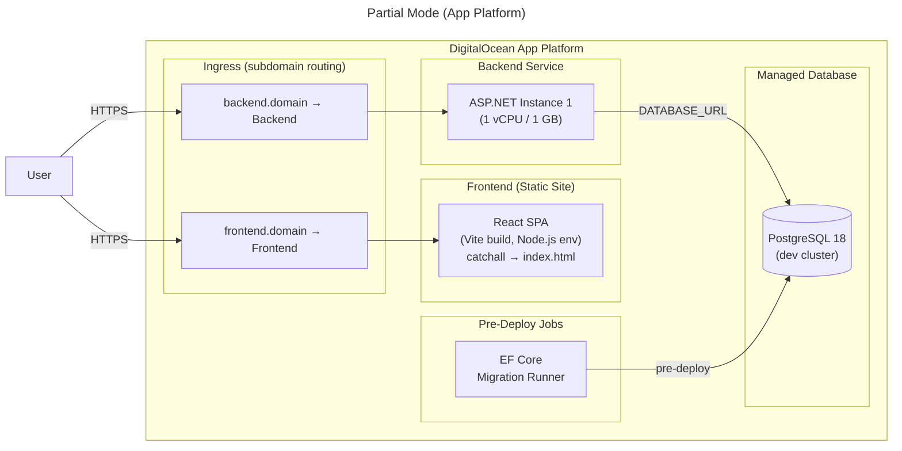
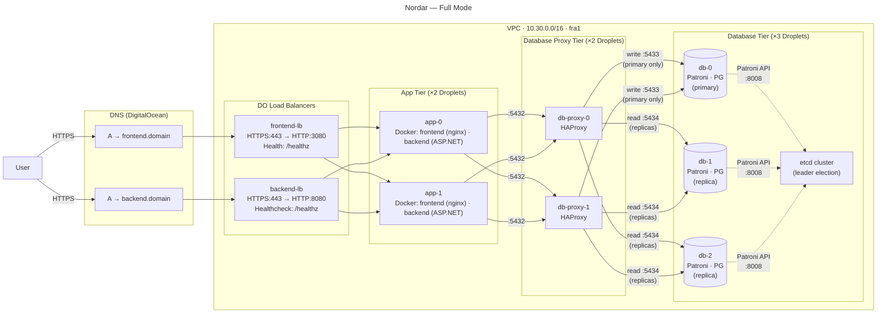

# nordar
Nordar is a research-backed galaxy-themed web application to help you set meaningful goals. It comes with three deployment modes: demo and partial (for demonstrations), as well as full (for production, with a HA setup). A demo is available at [frontend.twilightzone.dev](https://frontend.twilightzone.dev).

I created this project as I struggled with keeping up with my goals; I would usually give up after only a couple of weeks. Ironically enough, the time spent on this project ended up harming my ambitions. Regardless, I did learn a couple of tips from all the research I did.

## Quick Start

To run the web application on your machine, you can use the provided Docker Compose project. Before starting, make sure to install Docker Desktop and log in to Docker Hub to be able to pull Docker Hardened Images.
1. Navigate to the `./app` with `cd ./app`.
2. Run `docker compose up`.
3. Head to `localhost:3080`.

## Knowledge Base

### Concepts

Nordar uses a navigational metaphor:
* **North Stars** are life ambitions such as "be healthy".
* **Bearings**  are strategies to accomplish North Stars, such as "go to sleep early", "exercise regularly" or "eat a healthy diet".
* **Movements** are concrete actions tied to Bearings, such as "walk 8.000 steps daily" or "cook dinner 5 nights a week."

### Features

Nordar has a variety of features:
* The **Landing** page is a marketing page with various sections to entice users.
* The **Authentication** page can be used for signing in and signing up. A "sign out" button is available on the top right inside the application.
* The **Dashboard** page shows basic statistics as well as the events scheduled for that day. Event state can be managed on this page.
* The **Calendar** page lets users manage their events, which can be linked to Movements. Events can be one-time or recurring, where the latter is defined with RRULEs. Currently, events cannot be updated or deleted.
* The **Stars** page, users can create, update and delete North Stars, Bearings and Movements.
* In the **Reflections** page, users can look back at their past reflections to learn from them. Currently, reflections cannot be updated or deleted.

### Stack

#### Frontend

* **Development**: Biome
* **Bundler**: Vite
* **Framework**: React and TypeScript
* **Routing**: React Router
* **UI**: Mantine and Tabler Icons
* **Data**: TanStack Query
* **API Client**: Orval
* **Validation**: Zod

#### Backend

* **Framework**: C# and ASP.NET
* **Identity**: ASP.NET Core Identity
* **ORM**: Entity Framework Core and Npgsql
* **Mapping**: AutoMapper
* **Logging**: Serilog and Destructurama
* **API Contract**: OpenAPI

#### Infrastructure

* **Cloud**: DigitalOcean
* **Provisioning**: Terraform
* **Configuration Management**: Ansible
* **Golden Images**: Packer
* **Containers**: Docker

#### Deployment

##### Demo

Demo mode, as its name suggests, is meant for demonstrations. It uses Docker Compose to create four different containers using Docker Hardened Images:
* frontend
* backend
* migrations
* database

A tutorial for using this deployment mode is available in the Quick Start section.

##### Partial

Partial mode, similarly to demo mode, is meant for more advanced demonstrations. It uses DigitalOcean App Platform. It creates four components:
* An ingress, to route requests to the frontend and backend
* A static site, for the frontend
* A backend service
* A database

To use this mode, create a DigitalOcean Spaces bucket called `nordar-partial-tfstate` in `fra1` for state and set up a domain on DigitalOcean. Finally, run the `terraform-deploy` workflow with the `partial` parameter. Updates will be deployed automatically.

##### Full

Full mode is meant for production deployments, as it comes with a HA setup (intentionally avoiding managed services for learning purposes). It creates:
* Backend LB
* Backend nodes, with Docker installed
* HAProxy nodes, to route to backend nodes
* Database nodes, with PostgreSQL, Patroni and etcd

To use this mode, create a DigitalOcean Spaces bucket called `nordar-tfstate` in `fra1` for state and set up a domain on DigitalOcean. The deployment consists of three stages, which must be executed in order:
* `packer-deploy.yaml`: Packer builds and uploads three machine images (backend, database-proxy, database) on top of Debian 13 images. It uses Ansible to apply server hardening as well as machine-type specific configuration.
* `terraform-deploy.yaml`: Terraform provisions nodes, LBs and DNS records. It stores state in a DigitalOcean Spaces bucket.
* `ansible-deploy.yaml`: Ansible bootstraps all machines. It distributes TLS certificates, templates configuration files, creates clusters, starts containers and runs migrations.

### Credentials

Deploying Nordar requires a set of credentials and variables in the `production` environment:
| Credential | Description | Deployment Mode |
| --- | --- | ---
| ANSIBLE_SSH_PRIVATE_KEY | Ansible SSH private key | Full |
| DO_API_TOKEN | DigitalOcean API token | Partial, Full |
| PKI_ANSIBLE_PRIVATE_KEY | Private key for Ansible CA for signing service certificates | Full |
| POSTGRESQL_APP_USER_PASSWORD | PostgreSQL password for app_user | Full |
| POSTGRESQL_POSTGRES_PASSWORD | PostgreSQL password for postgres | Full |
| POSTGRESQL_REPLICATION_USER_PASSWORD | PostgreSQL password for replication_user | Full |
| POSTGRESQL_REWIND_USER_PASSWORD | PostgreSQL password for rewind_user | Full |
| SPACES_ACCESS_ID | DigitalOcean Spaces access ID | Partial, Full |
| SPACES_SECRET_KEY | DigitalOcean Spaces secret key | Partial, Full |

| Variable | Description | Deployment Mode |
| --- | --- | --- |
| ANSIBLE_SSH_PUBLIC_KEY | Ansible SSH public key | Full |
| DEV_SSH_PUBLIC_KEY | Developer SSH public key | Full |
| DOMAIN | Domain to host Nordar on | Partial, Full |
| PKI_ANSIBLE_CERTIFICATE | Public key for Ansible CA for signing service certificates | Full |
| PKI_CHAIN_CERTIFICATE | Public key for Ansible CA for signing service certificates | Full |
| PKI_ROOT_CERTIFICATE | Public key for root CA for signing service certificates | Full |
| RUNNER_DATA_DIR | Directory for data exchange with the runner (such as `/tmp/.data`) | Full |

### Workflows

Nordar uses GitHub Actions as CI/CD. This table shows all workflows:

| Workflow | Purpose | Trigger |
| --- | --- | --- |
| ansible-deploy.yaml | Apply runtime Ansible manifests | Manual
| ansible-lint.yaml | Lint Ansible manifests | Pushes and PRs to core branches
| docker-deploy.yaml | Build and publish Docker images on GHCR | Pushes to main |
| packer-deploy.yaml | Build and upload golden machine images to Docker | Manual |
| packer-validate.yaml | Validate Packer manifests | Pushes and PRs to core branches |
| terraform-deploy.yaml | Provision necessary resources | Manual |
| terraform-run.yaml | Run freeform Terraform commands | Manual |
| terraform-validate.yaml | Validate Terraform manifests | Pushes and PRs to core branches |

### Images

